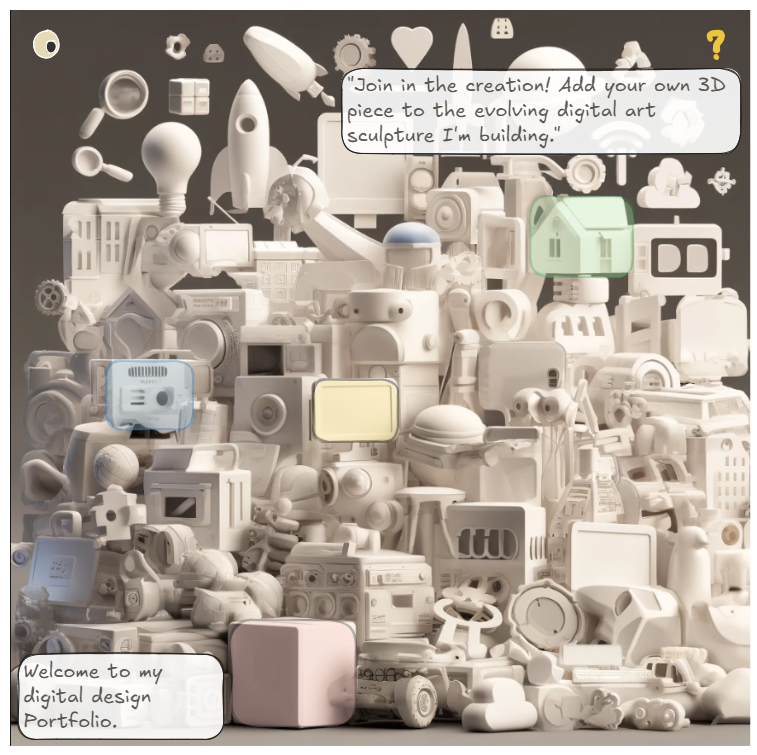
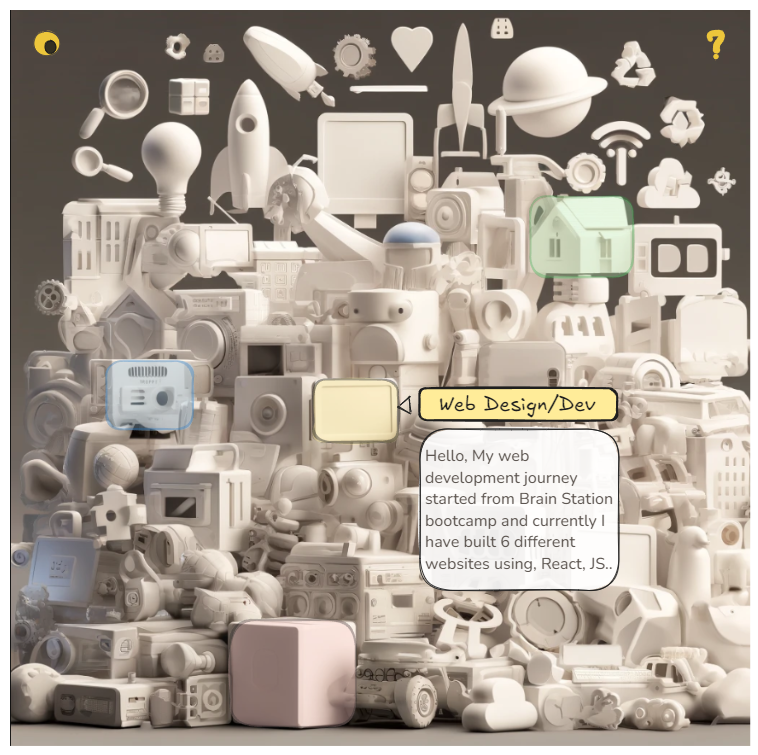
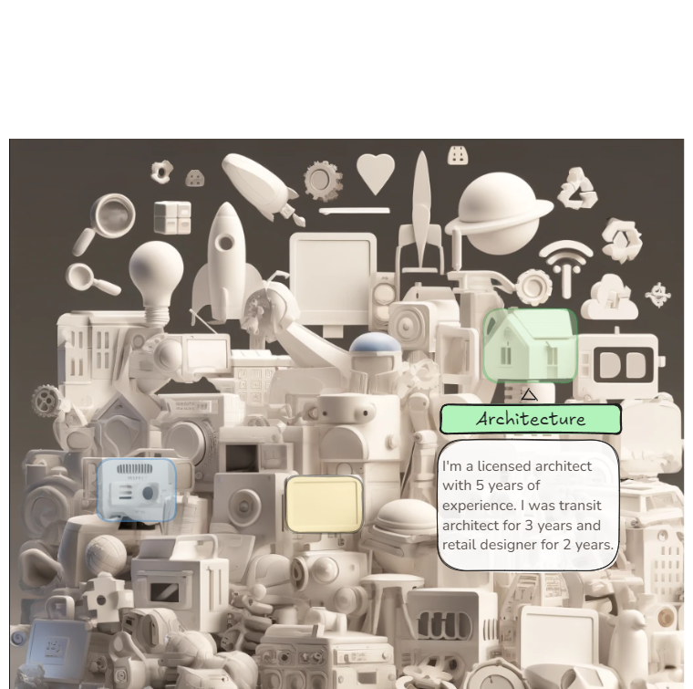
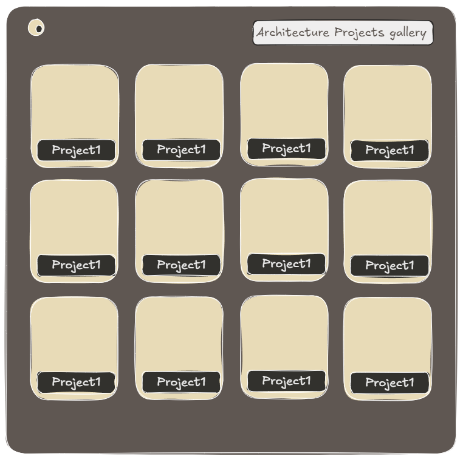
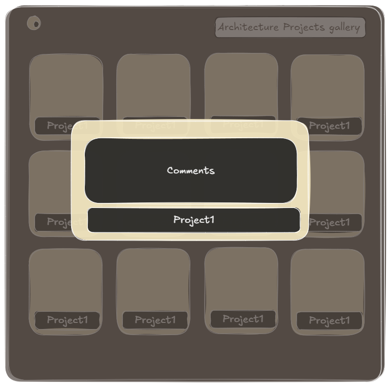
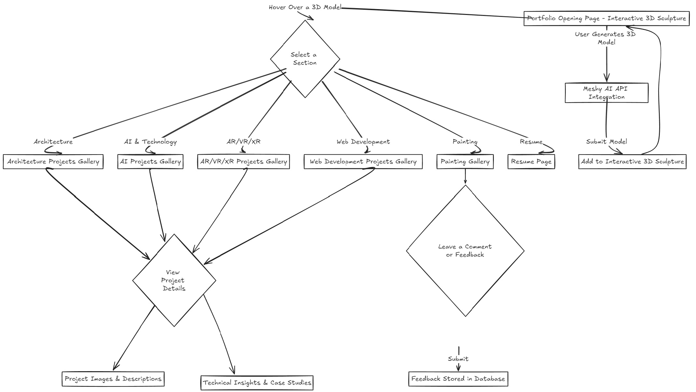
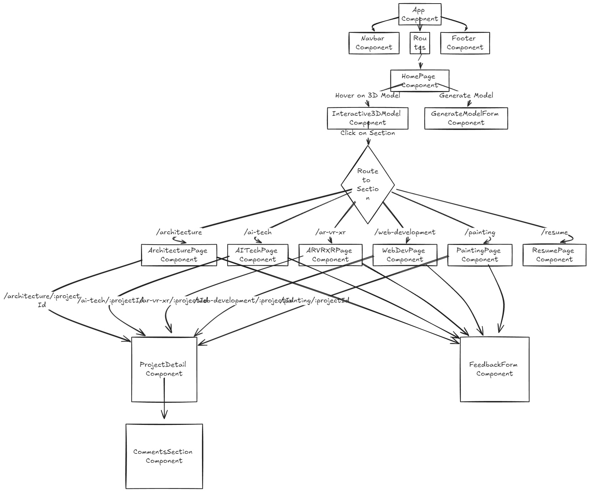

# Project Title
"First-Point"

## Overview

"First-Point" is an interactive portfolio landing page showcasing my skills in architecture, AI, web design, and AR/VR/XR. It features a collaborative 3D model space where users can explore and contribute via a text-to-3D API integration.

### Problem Space

Traditional portfolio websites often fail to capture the attention of their viewers or to create memorable experiences. "First-Point" aims to break away from this norm by offering a highly interactive and personalized experience that not only showcases my skills and projects but also encourages user engagement. By inviting users to add their input to a collaborative 3D sculpture on the opening page, the website creates a sense of involvement and helps build a unique, evolving digital identity. This interactivity leaves a lasting impression and establishes a deeper connection with visitors.

### User Profile

Primary Users: Potential employers, collaborators, and clients interested in my digital programming and design skills.
Secondary Users: Creative professionals, digital artists, and enthusiasts of interactive art and digital installations.

### Features

List the functionality that your app will include. These can be written as user stories or descriptions with related details. Do not describe _how_ these features are implemented, only _what_ needs to be implemented.

As a user, I'll be able to know Raksha's areas of interest
As a user, I can add it to the collaborative installation, becoming a part of Raksha’s portfolio
As a user, I can browse through each sections of projects
As a user, I can read about details oh her each project
As a user, I can leave a comment to her works

## Implementation

### Tech Stack

List technologies that will be used in your app, including any libraries to save time or provide more functionality. Be sure to research any potential limitations.

- React
- javaScript
- Three.js
- MySQL
- Express
- Client libraries: 
    - react
    - react-router
    - axios
- Server libraries:
    - knex
    - express
- External APIs:
     Meshy AI (for text-to-3D model generation)

### APIs

Meshy AI API: Used for generating 3D models from text descriptions. This will allow users to create and add their models to the interactive 3D sculpture on the website.
https://docs.meshy.ai

### Sitemap

- Home Page (Interactive Installation): A dynamic 3D "dump" of models where users can explore and contribute.
- Architecture Projects Gallery: Showcasing projects and works related to architecture.
- AR/VR/XR Projects Gallery: A collection of projects focused on augmented, virtual, and extended reality.
- Web Development Projects Gallery: Showcasing web development projects and related skills.
- Resume Page: A detailed view of Raksha’s experience, skills, and qualifications.
- Painting Gallery: Displaying digital and physical art pieces.
- AI Projects Gallery: Highlighting projects in AI, machine learning, and related technologies.

### Mockups

#### Home Page

#### Sections of portfolio- intro

#### Sections of portfolio- intro2

#### Gallery

#### Comments

### Data

### Endpoints

GET /projects: Fetch all projects by category (architecture, AI, XR, etc.)
POST /models: Add a new user-generated model to the 3D installation
GET /comments: Fetch comments for a particular project or model
POST /comments: Add a new comment or feedback from a user

## Roadmap

- Days 1-2: Set up the project structure and initialize the tech stack (React, Express, MySQL).
- Days 3-4: Develop the backend, setting up routes, database models, and endpoints.
- Days 5-6: Implement the frontend interactive installation using Three.js and integrate the Meshy AI API.
- Days 7-8: Build out the detailed gallery pages for different sections (Architecture, AI, XR, etc.).
- Days 9-10: Testing, debugging, and final polish—focus on UI/UX and optimizing performance for a smooth experience.

---

## Future Implementations

- Augmented Reality (AR) Integration: Allow users to view their generated models in their physical environment.
- Advanced Collaboration Tools: Enable real-time collaboration where multiple users can add or modify models simultaneously.
- Enhanced User Profiles: Allow users to create profiles to track their contributions, view feedback, and interact with other users.
- Analytics Dashboard: Provide insights into user engagement, popular projects, and user-generated content.
